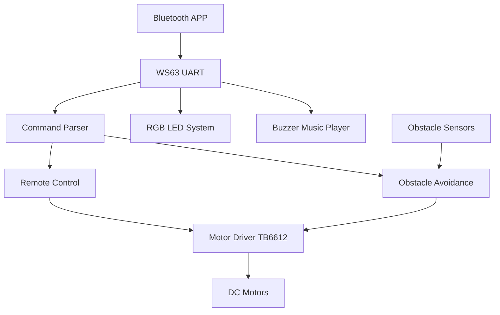

#  BearPi WS63 智能蓝牙避障小车

<p align="center">
  <a href="./README.md">简体中文</a> |
  <a href="./README_EN.md">English</a>
</p>

<p align="center">
  基于 BearPi WS63 + CMSIS-RTOS 的智能蓝牙遥控避障小车
</p>

---

## 项目简介

本项目基于 **BearPi WS63 开发板** 开发，实现了一套集：

* 蓝牙遥控
* 智能避障
* PWM 电机控制
* RGB 氛围灯
* 蜂鸣器音乐播放
* CMSIS-RTOS 多线程调度

于一体的智能小车系统。

用户可通过手机蓝牙发送控制指令，实现小车实时运动控制；同时系统支持自动避障模式，在检测到障碍物后自主规划转向路线。

---

## 功能展示

### 蓝牙遥控模式

支持：

* 前进
* 后退
* 左转
* 右转
* 停车
* 速度调节

控制协议：

```text
Lw*  前进
Ls*  后退
La*  左转
Ld*  右转
L0*  停止

S80* 设置速度80%
```

---

### 智能避障模式

通过三个红外避障传感器：

* 左侧检测
* 前方检测
* 右侧检测

实现：

* 自动前进
* 障碍检测
* 自动转向
* 自动掉头

避障逻辑：

```text
无障碍
    ↓
   前进

左侧障碍
    ↓
   右转

右侧障碍
    ↓
   左转

前方障碍
    ↓
 后退+掉头
```

---

### RGB 灯光系统

支持：

* 红色
* 绿色
* 蓝色
* 黄色
* 紫色
* 青色
* 白色

以及：

* 自动循环变色模式

---

### 音乐播放系统

PWM 驱动蜂鸣器播放音乐。

当前实现：

* Jingle Bells（铃儿响叮当）

支持：

* 音符频率控制
* 节拍控制
* 曲库扩展

---

## 系统架构



---

## 多线程架构

系统基于 CMSIS-RTOS 实现。

```text
MainTask
│
├── BluetoothTask
│   └── 蓝牙数据接收
│
├── LedTask
│   └── RGB灯控制
│
├── BuzzerTask
│   └── 音乐播放
│
└── MainTask
    └── 运动控制
```

---

## 硬件组成

| 模块   | 型号          |
| ---- | ----------- |
| 主控   | BearPi WS63 |
| 电机驱动 | TB6612      |
| 通信模块 | HC-05/蓝牙串口  |
| 避障模块 | 红外避障传感器     |
| RGB灯 | 三色LED       |
| 蜂鸣器  | PWM蜂鸣器      |
| 电机   | TT减速电机      |

---

## 技术栈

### Embedded

* BearPi WS63
* C Language
* CMSIS-RTOS
* UART
* PWM
* GPIO

### Functional Modules

* Bluetooth Communication
* Motor Control
* Obstacle Avoidance
* RGB Lighting
* Music Playback

---

## 项目结构

```text
src/

├── main.c
├── bluetooth.c
├── motor.c
├── track.c
├── led.c
├── buzzer.c
└── joy.c

include/

├── bluetooth.h
├── motor.h
├── track.h
├── led.h
├── buzzer.h
└── joy.h
```

---

## 项目亮点

* BearPi WS63 实战项目
* CMSIS-RTOS 多线程设计
* 蓝牙遥控与自动避障双模式
* PWM 电机速度控制
* RGB 灯光效果
* 蜂鸣器音乐播放
* 完整嵌入式系统开发流程

---

## 应用场景

* 智能巡检机器人
* 教学实验平台
* 嵌入式课程设计
* 机器人竞赛入门
* IoT 控制系统学习

---

## GPIO Mapping

| GPIO | Function |
|--------|--------|
| GPIO0 | RGB Red |
| GPIO1 | Motor PWM Left |
| GPIO2 | Motor PWM Right |
| GPIO3 | TB6612 AIN1 |
| GPIO6 | TB6612 AIN2 |
| GPIO7 | TB6612 BIN1 |
| GPIO8 | TB6612 BIN2 |
| GPIO9 | Left Obstacle Sensor |
| GPIO10 | Front Obstacle Sensor |
| GPIO11 | Right Obstacle Sensor |
| GPIO12 | Buzzer PWM |
| GPIO13 | RGB Green |
| GPIO14 | RGB Blue |
| GPIO15 | Bluetooth TX |
| GPIO16 | Bluetooth RX |


## 支持项目

如果本项目对你有所帮助，欢迎：

Star 本仓库

Fork 进行二次开发

提交 Issue 与 Pull Request

你的支持是项目持续维护的动力。
