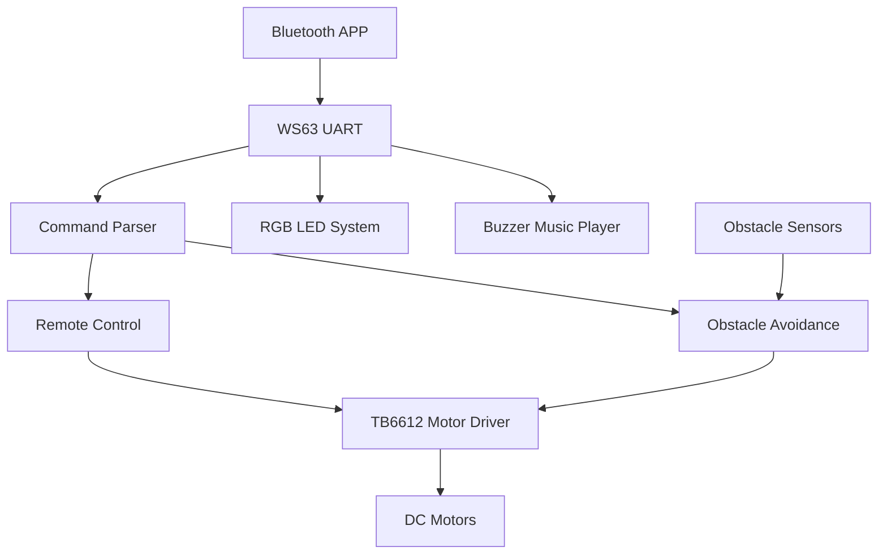

# BearPi WS63 Smart Bluetooth Obstacle Avoidance Car

<p align="center">
  <a href="./README.md">简体中文</a> |
  <a href="./README_EN.md">English</a>
</p>

<p align="center">
  Smart Bluetooth-Controlled Obstacle Avoidance Car Based on BearPi WS63 and CMSIS-RTOS
</p>

---

## Project Overview

This project is developed on the **BearPi WS63** platform and integrates:

* Bluetooth Remote Control
* Autonomous Obstacle Avoidance
* PWM Motor Control
* RGB Lighting Effects
* Buzzer Music Playback
* CMSIS-RTOS Multithreading

The vehicle can be controlled remotely via a smartphone Bluetooth application. It also supports an autonomous obstacle avoidance mode that enables the car to detect obstacles and adjust its route automatically.

---

## Features
【基于BearPi WS63的避障小车 | 蓝牙遥控 + CMSIS-RTOS多线程】 https://www.bilibili.com/video/BV18Q7h6SEa9/?share_source=copy_web&vd_source=c433baf5fc3d8d82f7f73c85e1a2e108
### Bluetooth Remote Control Mode

Supported functions:

* Forward
* Backward
* Turn Left
* Turn Right
* Stop
* Speed Adjustment

Control Protocol:

```text
Lw*  Move Forward
Ls*  Move Backward
La*  Turn Left
Ld*  Turn Right
L0*  Stop

S80* Set Speed to 80%
```

---

### Autonomous Obstacle Avoidance Mode

Three infrared obstacle sensors are used:

* Left Sensor
* Front Sensor
* Right Sensor

Functions:

* Automatic Forward Movement
* Obstacle Detection
* Automatic Steering
* U-Turn Recovery

Obstacle Avoidance Logic:

```text
No Obstacle
     ↓
   Forward

Left Obstacle
     ↓
 Turn Right

Right Obstacle
     ↓
 Turn Left

Front Obstacle
     ↓
Reverse + U-Turn
```

---

### RGB Lighting System

Supported colors:

* Red
* Green
* Blue
* Yellow
* Purple
* Cyan
* White

Additional feature:

* Automatic Color Cycling Mode

---

### Music Playback System

The buzzer is driven by PWM signals to play melodies.

Currently implemented:

* Jingle Bells

Features:

* Musical Note Frequency Control
* Rhythm Control
* Expandable Music Library

---

## System Architecture



---

## Multithreaded Architecture

The system is implemented using CMSIS-RTOS.

```text
CMSIS-RTOS

├── MainTask
│   └── Vehicle Motion Control
│
├── BluetoothTask
│   └── Bluetooth Data Reception
│
├── LedTask
│   └── RGB Lighting Control
│
└── BuzzerTask
    └── Music Playback
```

---

## Hardware Components

| Module               | Model                     |
| -------------------- | ------------------------- |
| Main Controller      | BearPi WS63               |
| Motor Driver         | TB6612                    |
| Communication Module | HC-05 Bluetooth Module    |
| Obstacle Sensors     | Infrared Obstacle Sensors |
| RGB Light            | RGB LED                   |
| Buzzer               | PWM Buzzer                |
| Motors               | TT DC Gear Motors         |

---

## Technology Stack

### Embedded Platform

* BearPi WS63
* C Programming Language
* CMSIS-RTOS
* UART
* PWM
* GPIO

### Functional Modules

* Bluetooth Communication
* Motor Control
* Obstacle Avoidance
* RGB Lighting
* Music Playback

---

## Project Structure

```text
src/

├── main.c
├── bluetooth.c
├── motor.c
├── track.c
├── led.c
├── buzzer.c
└── joy.c

include/

├── bluetooth.h
├── motor.h
├── track.h
├── led.h
├── buzzer.h
└── joy.h
```

---

## Highlights

* Practical BearPi WS63 Embedded Project
* CMSIS-RTOS Multithreaded Design
* Dual Operating Modes: Bluetooth Control & Obstacle Avoidance
* PWM-Based Motor Speed Control
* RGB Lighting Effects
* Buzzer Music Playback
* Complete Embedded System Development Workflow

---

## Application Scenarios

* Autonomous Inspection Robots
* Embedded Systems Education
* Robotics Training Platforms
* Engineering Course Projects
* IoT and Smart Vehicle Learning

---

## GPIO Mapping

| GPIO   | Function              |
| ------ | --------------------- |
| GPIO0  | RGB Red               |
| GPIO1  | Left Motor PWM        |
| GPIO2  | Right Motor PWM       |
| GPIO3  | TB6612 AIN1           |
| GPIO6  | TB6612 AIN2           |
| GPIO7  | TB6612 BIN1           |
| GPIO8  | TB6612 BIN2           |
| GPIO9  | Left Obstacle Sensor  |
| GPIO10 | Front Obstacle Sensor |
| GPIO11 | Right Obstacle Sensor |
| GPIO12 | Buzzer PWM            |
| GPIO13 | RGB Green             |
| GPIO14 | RGB Blue              |
| GPIO15 | Bluetooth TX          |
| GPIO16 | Bluetooth RX          |

---

## Support the Project

If this project helps you, please consider:

Starring this repository

Forking it for your own development

Submitting Issues or Pull Requests

Your support motivates continued development and maintenance.
